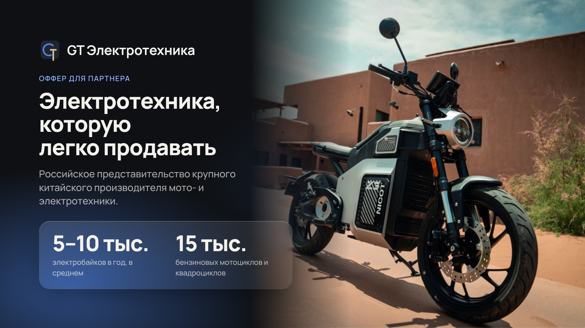
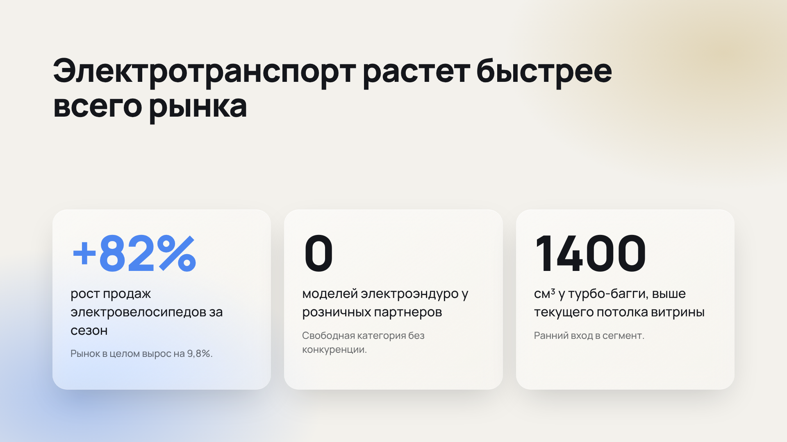
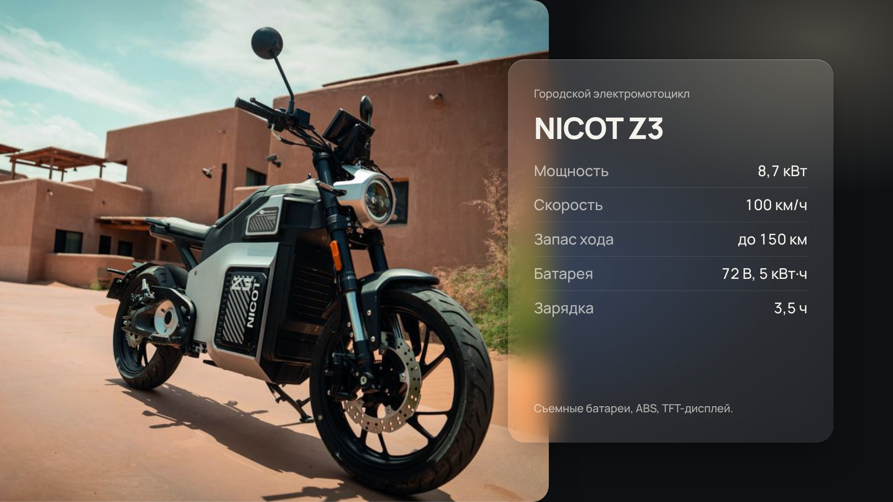

# deck-design-skills

Дизайн-навык для Claude Code и других агентов: делает презентации, КП и офферы
в современном стиле (чистая типографика, Liquid Glass, матовое стекло) и **не дает
скатываться в типичную безвкусицу нейросетей**: рамки вокруг фото, слова, растянутые
вручную, один и тот же Inter, плоские карточки на плоском фоне.





## Что внутри

| Путь | Что это |
|---|---|
| `skills/presentation-design/SKILL.md` | Навык: роль, запреты, рабочий процесс, правила заказчика |
| `references/typography.md` | Пары шрифтов (все с кириллицей), шкала, правила набора |
| `references/liquid-glass.md` | Принципы Liquid Glass, рецепты, что не является стеклом |
| `references/layout-and-color.md` | Сетка 1920x1080, композиции, фото, палитра |
| `references/anti-patterns.md` | 20 анти-паттернов с заменой и чек-лист |
| `assets/tokens.css`, `assets/glass.css` | Токены и материал стекла, готовые к подключению |
| `examples/deck.html` | Эталонная колода из 3 слайдов |
| `examples/bad-deck.html` | Антипример: на нем линтер обязан выдать ошибки |
| `tools/lint-deck.mjs` | Проверка колоды на анти-паттерны (шрифты, рамки, трекинг, стекло в стекле, ё, длинные тире, заглушки) |
| `tools/render.mjs` | Рендер в PDF и PNG каждого слайда |
| `assets/style-dell96-glass.css`, `references/styles/dell96-glass.md` | Пресет "Dell 1996 x Liquid Glass": плоские ленты в черной рамке плюс стекло |
| `assets/style-uber-glass.css`, `references/styles/uber-glass.md` | Пресет "Uber x Liquid Glass" (старый вариант КП GT, пилюли и карточки по Uber) |
| `examples/deck-uber-glass.html` | Эталон этого стиля, текущий выбор для КП |
| `examples/deck-dell96.html` | Эталон этого стиля: КП из 5 слайдов |
| `docs/references.md` | Легкие внешние референсы и сборки: что брать, что нет |

## Установка навыка

В проект:

```bash
mkdir -p .claude/skills
cp -r skills/presentation-design .claude/skills/
```

Или для всех проектов: `~/.claude/skills/presentation-design`.
Затем в `CLAUDE.md` проекта добавь строку из `CLAUDE.md` этого репозитория, чтобы
навык применялся к любой работе со слайдами.

## Работа

```bash
npm install
node tools/lint-deck.mjs deck.html     # ошибки и предупреждения, код 1 при ошибках
node tools/render.mjs deck.html out    # out/deck.pdf и out/slide-NN.png
```

Слайд это `<section class="slide">` размером 1920x1080. Подключи `tokens.css` и
`glass.css`, собери из блоков `examples/deck.html`.

Процесс обязателен: собрать, **запустить линтер, посмотреть каждый PNG и PDF**,
исправить, только потом отдавать. Линтер ловит механические ошибки, вкус
проверяется глазами по чек-листу.

## Установленные сторонние навыки

- [jiji262/claude-design-skill](https://github.com/jiji262/claude-design-skill) (MIT): общий навык дизайна HTML-артефактов (колоды, лендинги, прототипы), клонирован в `~/.claude/skills/claude-design-skill`. Установка в новой среде: `git clone --depth 1 https://github.com/jiji262/claude-design-skill ~/.claude/skills/claude-design-skill` или `npx skills add jiji262/claude-design-skill -g`. Наш навык `presentation-design` приоритетнее для слайдов: он задает стили и проверку.

## Правила заказчика (можно менять в SKILL.md)

- Буква "ё" не используется, пишем "е".
- Длинное тире "—" не используется: короткое "–" как знак препинания, дефис внутри слов.
- Без цен в КП, если не просили. Без заглушек в готовых файлах.

## Ограничения

- Стекло рассчитано на рендер через Chromium (PDF, PNG). В артефакте Slides
  доступно меньше: см. раздел в `liquid-glass.md`.
- Список шрифтов можно менять переменной `DECK_FONTS` для линтера.
- Фото в примере взято из каталога GT Bikers (NICOT Z3), замени на свои.
